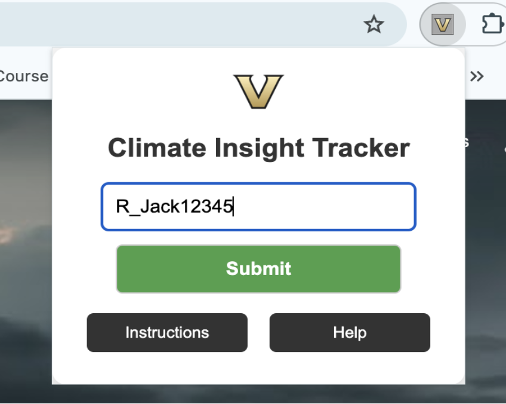

# Climate Insight Tracker



## Plugin Purpose
The **Climate Insight Tracker** Chrome extension is designed to scrape Google search results during a survey experiment. It collects relevant metadata (titles, descriptions, URLs, and ranks) and links it to Qualtrics survey data using unique User IDs.

The plugin enables seamless collection and storage of data in AWS DynamoDB for later analysis, making it valuable for:
- Data-driven decision-making processes
- Marketing and SEO research
- Social science and user behavior studies

---

## Features
1. **Real-Time Data Collection**: Scrapes Google search results in real time.
2. **User ID Validation**: Ensures submissions begin with the prefix `R_` for accuracy.
3. **Secure Storage**: Stores search activity data securely in AWS DynamoDB.
4. **User-Friendly Interface**: Simple and intuitive popup UI for entering User ID and accessing instructions.
5. **Linked Survey Data**: Connects search results to survey data for precise insights.

---

## Limitations
- Works only with Google search results.
- Requires users to enter a valid User ID starting with `R_`.
- Network interruptions may impact real-time data collection.

---

## Workflow
1. **Step 1**: Open the Chrome extension popup.
2. **Step 2**: Enter your User ID (e.g., `R_12345`) and submit.
3. **Step 3**: Open the survey form. The extension starts tracking when the survey form tab is active.
4. **Step 4**: Search on Google. The extension captures search queries, result links, and clicked links.
5. **Step 5**: Tracking stops automatically when the survey form tab is closed. Data is then sent to the backend for storage in DynamoDB.

---

## Instructions to Run

### Prerequisites
- **Node.js** installed on your system.
- **Google Chrome** browser.
- **AWS DynamoDB** setup and access credentials.

### Backend Setup

1. **Navigate to the backend directory**:  
   Open your terminal and navigate to the directory containing the backend files.
   ```bash
   cd backend

2. **Install dependencies**:  
   Install all the required packages for the backend server by running.
   ```bash
   npm install

3. **Configure Environment Variables**:  
   Create a .env file in the backend directory and add the following variables.
   ```bash
    AWS_REGION=your-region
    AWS_ACCESS_KEY_ID=your-access-key
    AWS_SECRET_ACCESS_KEY=your-secret-key
    DYNAMODB_TABLE_NAME=your-dynamodb-table-name

4. **Start the backend server**:  
   Launch the server by running.
   ```bash
   npm run start


